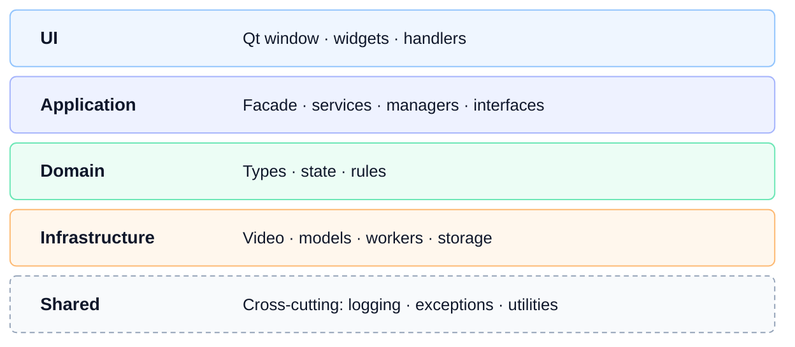
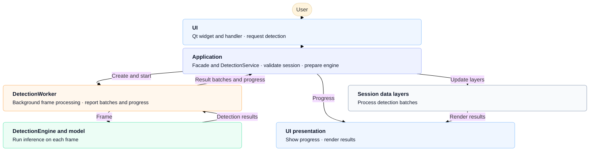

# Architecture

Blurzy is a PySide6 desktop application organized into five broad layers under
`src/app`: **UI**, **Application**, **Domain**, **Infrastructure**, and
**Shared**. The layers separate user interaction and workflow coordination
from video/model integrations and core data types. They describe the current
code organization; they are not yet enforced as strict package boundaries.

## Layer relationships

The stack shows code organization, not a strict dependency hierarchy. UI delegates user actions to Application, which coordinates Domain data and Infrastructure implementations. Infrastructure reads and writes Domain data and implements interfaces declared in Application. Shared utilities are imported across layers. Domain owns concepts such as boxes, processing settings, sessions, and video metadata; it is not the location for Qt workflows or model-specific code.

## Layer responsibilities and component map

| Layer | Responsibility | Main packages |
| --- | --- | --- |
| [UI](architecture/ui/index.md) | Qt widgets and dialogs, user-action handlers, controller, and view state | `ui/handlers`, `ui/qt`, `ui/adapters` |
| [Application](architecture/application/index.md) | Workflow facade, services, session lifecycle, manager coordination, and worker interfaces | `application/services`, `application/managers`, `application/interfaces` |
| [Domain](architecture/domain/index.md) | Video/session/detection/tracking/export types and rules | `domain/video`, `domain/session`, `domain/detection`, `domain/tracking` |
| [Infrastructure](architecture/infrastructure/index.md) | Video I/O, inference and tracking algorithms, background workers, persistence | `infrastructure/video`, `infrastructure/detection`, `infrastructure/tracking`, `infrastructure/project` |
| [Shared](architecture/shared/index.md) | Cross-cutting logging, exceptions, image and annotation utilities | `shared/` |

Package-level component stubs follow the meaningful source-package structure.
They provide a place to add detailed design notes without creating a page for
every Python module. See the component links in the navigation.

### Important components

- `Application` (`src/app/application/application.py`) is the facade used by
  the UI. It owns the session manager and constructs application services.
- `UIController` (`src/app/ui/uicontroller.py`) owns the UI handlers and
  connects the Qt window to the facade.
- `SessionManager` and `SessionInitializer` coordinate per-video runtime
  objects. A `Session` holds the video runtime references and the four
  annotation/tracking data layers.
- Services such as `DetectionService`, `TrackingService`, and `ProjectService`
  coordinate use cases; managers own selected worker/session lifecycles.
- Infrastructure contains `VideoReader`, detection engines and provider
  models, tracking strategies, background workers, `SessionDataStore`, and
  `ProjectStore`.
- Application interfaces define worker/factory contracts consumed by
  application adapters and infrastructure implementations.

## Runtime workflows

### Startup and opening a video

`src/main.py` loads runtime configuration, initializes Qt, creates the
Application, Window, and UIController, then enters the Qt event loop. When a
video is opened, the UI handler calls the Application facade; session
management creates a session and `SessionInitializer` attaches the
`VideoReader`, domain `SessionState`, and `VideoDecodeWorker`. The decode
worker fills a bounded frame buffer, while playback controls request frames
through the Application and render them in the preview.

### Detection

Single-frame detection is also available. Background detection reads frames
and runs inference away from the GUI event loop; Qt signals carry result
batches, progress, completion, and errors back to application/UI code.
Detection engine factories and provider-specific model packages keep model
loading separate from UI widgets.

### Tracking, editing, and export

Tracking starts from available detection boxes in Layer A or B. The tracking
service validates the request, creates a `TrackingWorker` with a selected
strategy, and later synchronizes output to Layer C. Layer D is the
user-editable result layer, populated from tracking output when needed.
Annotation handlers update the selected layer and request the preview/table
to render again.

For blurred-video export, the export service reads the selected session and
uses Layer D when it contains boxes, otherwise Layer C. The export worker runs
the operation off the UI thread, reports progress, and supports cancellation.
The current video-rendering implementation is in the Application export
service and uses OpenCV; it is not a separate infrastructure renderer.
Annotation import/export services handle annotation data separately from
video rendering.

### Projects and persistence

The project service captures session paths, frame positions, settings, layer
data, and project directories in domain project documents. The infrastructure
`ProjectStore` serializes and validates the JSON project file. Loading
reopens the referenced videos and restores session settings and annotation
layers; unavailable or invalid sessions are reported as skipped.

## Data and background-work boundaries

- Domain data includes `SessionId`, `SessionState`, `ProcessingSettings`,
  `DetectionResult`, bounding boxes, project documents, and video metadata.
- Session annotation data is organized as Layer A (raw detections), Layer B
  (filtered/editable detections), Layer C (raw tracking output), and Layer D
  (editable tracking results).
- Infrastructure workers do not update Qt widgets directly. They emit Qt
  signals; application services/adapters and UI handlers consume those
  signals and update data or presentation.
- Session data store, project store, and video reader are distinct: project
  files persist project/session data, the session store holds live annotation
  layers, and the reader decodes source media.
- Exact threading and storage responsibilities vary by workflow. Consult the
  component page and implementation before changing a worker lifecycle.

## Finding your way around

- Application entry point and Qt bootstrap: `src/main.py`
- Workflow facade and composition: `src/app/application/application.py`
- Session lifecycle: `src/app/application/managers/`
- User-action handlers and controller: `src/app/ui/handlers/`,
  `src/app/ui/uicontroller.py`
- Qt window and widgets: `src/app/ui/qt/`
- Core types and rules: `src/app/domain/`
- Video, model, tracking, persistence, and worker implementations:
  `src/app/infrastructure/`
- Shared utilities: `src/app/shared/`
- Tests organized by source layer: `tests/`

Blurzy is evolving. These pages describe the current implementation and
provide a structure for future detail; they do not imply that every boundary
is complete or every proposal is implemented.
